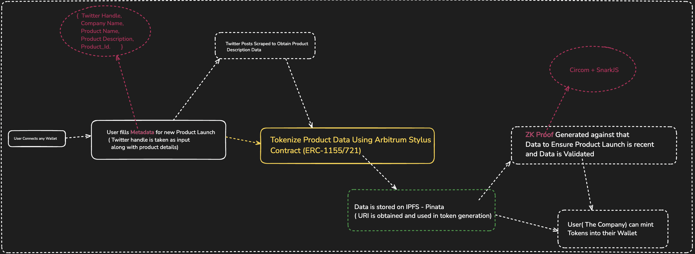
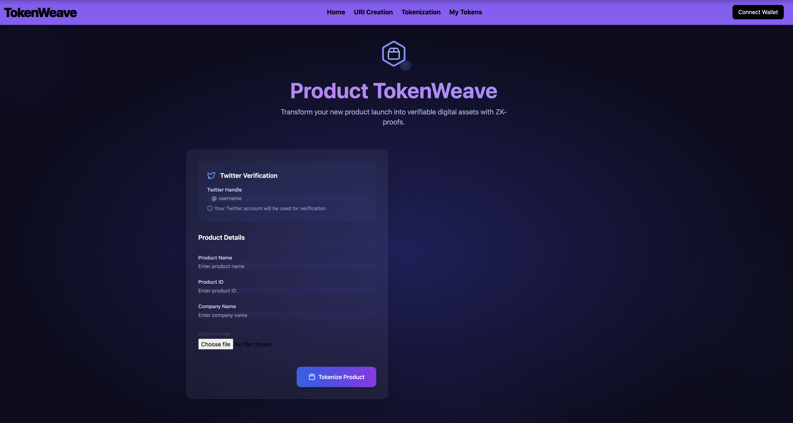

# ProductTokenWeave

ProductTokenWeave is a decentralized platform built using Arbitrum Stylus, integrated with the Twitter API for seamless product launch announcements, Tokenization and Twitter Marketing all passing through ZK-SNARKS Validation. It leverages RWA Tokenization to transform product details into secure digital assets and employs ZK-SNARK Proofs using Circom + Snarkjs to ensure privacy and authenticity.

## 🚀 Launch Your Product in Seconds! 
Simply provide your latest product details, and ProductTokenWeave will:
Announce your product launch on Twitter.
Tokenize product details as Real World Asset (RWA) tokens.
Secure transactions and data with ZK-SNARK Proofs.

## 🔧 Tech Stack
Arbitrum Stylus (Rust Contracts): Efficient and faster smart contract deployment.
Twitter API: Automated product launch announcements and marketing integration.
Circom + Snarkjs: ZK-SNARK Proof generation for secure and private verification.
Pinata IPFS: Decentralized storage for product details and metadata, ensuring security and immutability.

## 🌟 Key Features
Seamless Tokenization and Twitter Marketing: Effortlessly convert product details into digital tokens while simultaneously promoting your launch on Twitter.
Real-World Asset Tokenization: Securely tokenize your product details as RWA tokens, enabling digital ownership.
Privacy-Preserving Transactions: Utilizes ZK-SNARK Proofs to ensure data security and user privacy.
Efficient Smart Contract Deployment: Built on Arbitrum Stylus for fast, scalable, and cost-effective smart contracts.

